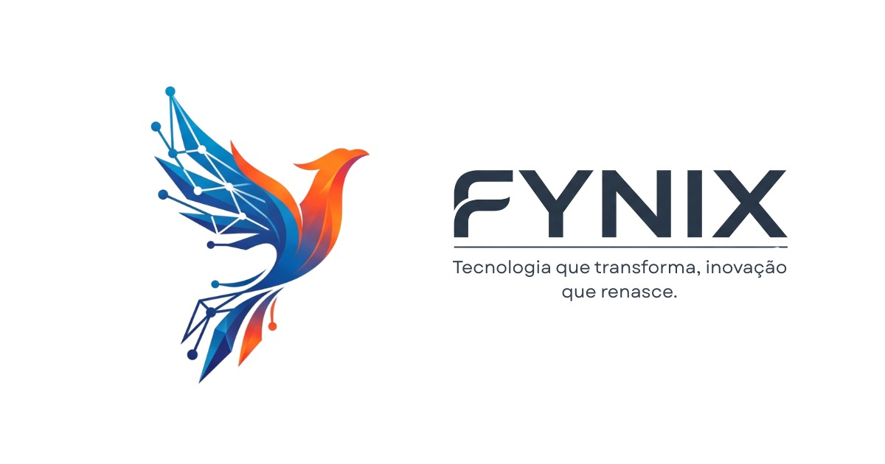


# Delícia Gelada — Termo de Abertura do Projeto (TAP)

> **Projeto Integrado** — SENAI Jandira | Curso Técnico em Desenvolvimento de Sistemas  
> **Empresa / Equipe:** Fynix

---

## 1. Identificação do Projeto

| Campo | Informação |
| :--- | :--- |
| **Nome do Projeto** | Delícia Gelada — Loja Virtual de Bebidas |
| **Empresa / Equipe** | Fynix |
| **Curso** | Técnico em Desenvolvimento de Sistemas |
| **Instituição** | SENAI Jandira |
| **Data de Início** | 03/06/2026 |
| **Data de Entrega** | 19/06/2026 |

---

## 2. Descrição do Projeto

A **Delícia Gelada** é uma plataforma de comércio eletrônico temática voltada para a comercialização e exposição de bebidas alcoólicas e não alcoólicas. O sistema visa oferecer uma experiência de navegação fluida para o cliente final através de um catálogo estruturado e, simultaneamente, fornecer uma área administrativa operacional (CRUD) para que os gestores possam gerenciar o estoque, categorias e visualizar os pedidos realizados na plataforma.

---

## 3. Justificativa

O mercado de e-commerce de bebidas no Brasil apresenta crescimento constante, impulsionado pela busca por conveniência e pela expansão do portfólio de produtos digitais. Para as empresas do setor, a falta de uma presença digital estruturada resulta em perda de competitividade e visibilidade.

Este projeto se justifica ao propor uma solução técnica viável e moderna que simula um ambiente real de negócios, permitindo a consolidação prática dos conhecimentos adquiridos no curso técnico através do desenvolvimento de uma vitrine digital integrada e funcional.

---

## 4. Objetivos do Projeto

* **Desenvolvimento Comercial:** Desenvolver uma loja virtual funcional voltada ao segmento de bebidas até o dia 19/06/2026.
* **Integração de Camadas:** Integrar de forma coesa as camadas de front-end, back-end e banco de dados relacional.
* **Usabilidade e Segurança:** Disponibilizar uma interface responsiva para os usuários e um painel administrativo seguro para gerenciamento de dados.

---

## 5. Escopo do Projeto

### 5.1. Escopo 

* **Landing Page:** Interface principal responsiva com destaque de produtos em promoção ou lançamentos.
* **Catálogo e Detalhes:** Exibição de produtos organizados por categorias e página dedicada para informações detalhadas de cada item.
* **Controle de Acesso:** Tela de validação de maioridade para conformidade com a legislação de bebidas alcoólicas.
* **Painel Administrativo:** Operações completas de CRUD (*Create, Read, Update, Delete*) para produtos e categorias, além de uma tela para listagem de pedidos.
* **Arquitetura Técnica:** Construção de uma API REST para comunicação síncrona entre o cliente e o servidor.
* **Persistência e Controle:** Banco de dados relacional MySQL para armazenamento seguro e versionamento de código via Git/GitHub.

### 5.2. Fora de Escopo

* ❌ Cálculo dinâmico de frete e total de carrinho de compras complexo.
* ❌ Fluxo de checkout simulado com persistência avançada de transações.
* ❌ Integração com gateways de pagamento reais (ex: Stripe, PagSeguro, PIX API).
* ❌ Sistemas logísticos ou de rastreamento de entregas em tempo real.
* ❌ Desenvolvimento de aplicativos móveis nativos (iOS/Android).
* ❌ Autenticação por provedores externos (OAuth via Google, Facebook, etc.).
* ❌ Módulo de avaliações, comentários ou sistema de reviews por parte dos clientes.

---

## 6. Partes Interessadas

| Parte Interessada | Papel / Responsabilidade no Projeto |
| :--- | :--- |
| **Equipe Fynix** | Responsável pelo planejamento, design, codificação, testes e implantação da solução técnica. |
| **Professores Orientadores** | Fornecer suporte técnico, validar os requisitos acadêmicos e atuar como avaliadores finais. |
| **SENAI Jandira** | Instituição de ensino provedora da infraestrutura e patrona do projeto integrado. |

---

## 7. Equipe de Desenvolvimento

* [Daniele Silva Santos](https://github.com/Daniele-SS) — Product Owner (PO)
* [Jean Costa Alvez da Silva](https://github.com/Jean090504) — Desenvolvedor Back-End / PO
* [Anderson Ribeiro Soares](https://github.com/Nephyro) — Administrador de Banco de Dados (DBA) / Desenvolvedor
* [Mayara Martins de Andrade](https://github.com/maymandrade) — Desenvolvedora / Analista de Qualidade e Documentação
* [Diego de Pádua Bezerra de Lemos](https://github.com/DiegodelPadua) — Desenvolvedor Front-End / Analista de Requisitos

---

## 8. Arquitetura Tecnológica

| Camada | Tecnologia Selecionada |
| :--- | :--- |
| **Front-End** | Tailwind, HTML5, CSS3, JavaScript |
| **Back-End** | Node.js |
| **Banco de Dados** | MySQL |
| **Versionamento** | Git + GitHub |

---

## 9. Cronograma Macro de Entrega

| Fase do Projeto | Entregáveis Principais | Prazo Limite |
| :--- | :--- | :--- |
| **Planejamento e Alinhamento** | Levantamento de Requisitos, TAP, Modelagem Conceitual/Lógica do Banco de Dados. | 03/06/2026 |
| **Desenvolvimento Ativo** | Codificação das interfaces, criação das rotas da API e estruturação das tabelas MySQL. | 04/06 a 16/06/2026 |
| **Integração e Testes** | Conexão Frontend-Backend via API REST, testes de usabilidade e correções de bugs. | 17/06 a 18/06/2026 |
| **Encerramento e Entrega** | Publicação final nos repositórios, gravação do vídeo pitch e apresentação institucional. | 19/06/2026 |

---

## 10. Gerenciamento de Riscos

| Risco Identificado | Probabilidade | Impacto | Estratégia de Mitigação |
| :--- | :--- | :--- | :--- |
| **Conflitos na integração técnica** | Média | Alto | Definir contratos rígidos de API (rotas, verbos HTTP e payloads) antes de iniciar os códigos de forma isolada. |
| **Atrasos por sobrecarga acadêmica** | Média | Alto | Adotar metodologias ágeis com divisão clara e igualitária de tarefas desde o primeiro dia. |
| **Inconsistências na modelagem de dados** | Baixa | Alto | Realizar sessões de revisão coletiva com toda a equipe e validação junto ao orientador antes de rodar os scripts. |
| **Falta de domínio técnico específico** | Média | Médio | Promover mentorias internas na equipe e priorizar o uso de documentações oficiais e padrões consolidados. |

---

## 11. Restrições e Premissas

**Restrições do Projeto:**
* O ambiente servidor deve ser obrigatoriamente construído utilizando a plataforma Node.js.
* O sistema de gerenciamento de banco de dados deve ser estritamente o MySQL.
* A data limite para a entrega final de todo o ecossistema e documentação é impreterivelmente 19/06/2026.

**Premissas do Projeto:**
* Haverá colaboração e participação ativa de todos os 5 integrantes em todas as etapas de engenharia do projeto.
* Os ambientes locais de desenvolvimento e laboratórios do SENAI estarão disponíveis e operacionais no período estipulado.
* O vídeo descritivo (*pitch*) obrigatório terá a duração exata ou máxima de 5 minutos.

---

## 12. Repositórios do Projeto

| Repositório | Link |
|-------------|------|
| 🖥️ Front-End | [Delicia-Gelada-FRONT_END](https://github.com/Daniele-SS/Delicia-Gelada-FRONT_END) |
| ⚙️ Back-End | [Delicia-Gelada-BACK_END](https://github.com/Jean090504/Delicia-Gelada-BACK_END) |
| 🗄️ Banco de Dados | [Delicia-Gelada-BANCO_DE_DADOS](https://github.com/Nephyro/Delicia-Gelada-BANCO_DE_DADOS) |

---

## 13. Vídeo Pitch
| 📽️ | (https://vimeo.com/1202789667?share=copy) |
---
*Termo de Abertura do Projeto — Fynix | SENAI Jandira — 2026*
